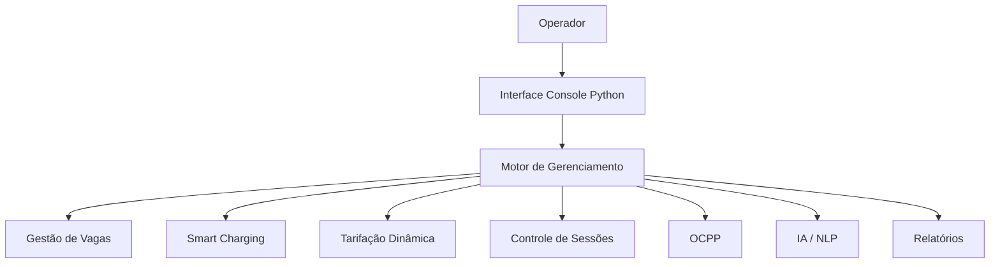
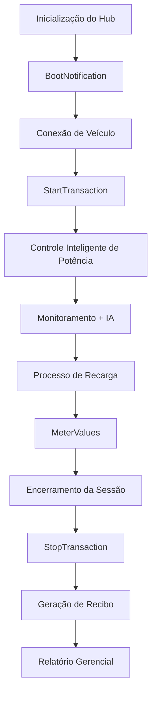

# REECHARGE – Sistema Inteligente de Gestão de Recarga para Veículos Elétricos

## 📖 Descrição da Solução

O REECHARGE é um sistema de gerenciamento inteligente para estações de recarga de veículos elétricos voltado ao ambiente comercial.
A solução simula a operação de um hub de carregamento com múltiplas vagas, incorporando funcionalidades de:
- Controle inteligente de potência (Smart Charging);
- Tarifação dinâmica baseada em horário;
- Monitoramento operacional em tempo real;
- Integração com o protocolo OCPP 1.6J;
- Análise preditiva por Inteligência Artificial;
- Geração de relatórios gerenciais e financeiros.
  
O objetivo do sistema é maximizar a eficiência energética da estação, evitar sobrecargas na infraestrutura elétrica e fornecer informações estratégicas para operadores e gestores.

## 🎯 Principais Funcionalidades

🔌 Gestão de Recargas

- Cadastro de veículos em vagas de carregamento.
- Controle do estado de carga (SOC).
- Simulação do processo completo de recarga.
  

⚡ Smart Charging

- Distribuição automática da potência disponível entre os veículos conectados.
- Prevenção de sobrecarga quando a demanda excede a capacidade do hub.

💰 Tarifação Dinâmica

- Aplicação automática de tarifas diferenciadas em horários de pico.
- Cálculo do custo total da sessão de recarga.

🤖 Inteligência Artificial

- Monitoramento da ocupação da estação.
- Geração de insights operacionais.
- Alertas preditivos de saturação da infraestrutura.
- Recomendações de horários mais eficientes para recarga.

🌐 Comunicação OCPP

Simulação das principais mensagens do protocolo Open Charge Point Protocol (OCPP):
- BootNotification
- StartTransaction
- MeterValues
- StopTransaction

  
📊 Relatórios Gerenciais

- Energia total fornecida.
- Receita gerada por sessão.
- Faturamento consolidado da estação.

## 🏗 Arquitetura do Sistema

## 🔄 Fluxo de Operação

## ⚙️ Configurações do Sistema

As principais variáveis podem ser ajustadas diretamente no código:

POTENCIA_NOMINAL_VAGA = 7.0      # kW por carregador

LIMITE_POTENCIA_HUB = 15.0       # Potência máxima da estação

TARIFA_BASE_COMERCIAL = 0.80     # R$/kWh

## 🚀 Como Executar

Pré-requisitos:
- Python 3.8 ou superior
- Clonar o Repositório:
'''
  git clone [https://github.com/seu-usuario/reecharge.git](https://github.com/posterllis2/SPRINT2_PCAP/tree/main)
  
  cd reecharge
'''
- Executar:
  python codigo.py

## 🧠 Inteligência Artificial Aplicada

O módulo de IA simula funcionalidades encontradas em plataformas modernas de gestão energética:

Análise Operacional:
- Identificação de uso elevado da infraestrutura.
- Monitoramento da ocupação do hub.

Alertas Preditivos:
- Detecção de cenários próximos à saturação.
- Previsão da ativação do Smart Charging.

Recomendações:
- Sugestão de horários de menor demanda.
- Otimização do consumo energético.

## 🔗 Materiais Técnicos Relevantes

Protocolo OCPP 1.6J
Protocolo aberto utilizado para comunicação entre carregadores e sistemas centrais de gerenciamento.
Principais mensagens simuladas:
- BootNotification
- StartTransaction
- MeterValues
- StopTransaction

Conceitos Utilizados
- Smart Charging: distribuição dinâmica da potência disponível entre múltiplos veículos conectados.
- Demand Response: estratégia de gerenciamento da carga elétrica para evitar picos de consumo.
- NLP (Natural Language Processing): utilizado para traduzir métricas operacionais em informações compreensíveis para gestores.
- IA Preditiva: empregada para gerar alertas e recomendações operacionais com base no estado atual da estação.

## 📈 Possíveis Evoluções

- Interface Web.
- Dashboard em tempo real.
- Banco de dados para persistência das sessões.
- Integração com APIs reais de carregadores.
- Machine Learning para previsão de demanda.
- Integração com geração fotovoltaica e sistemas de armazenamento.
Aplicativo mobile para usuários finais.

##👥 Equipe
Enzo Posterlli Strinta - RM570035
Giovanna Tristão Lopes - RM572552
Vinicius Brito Davi - RM569709
